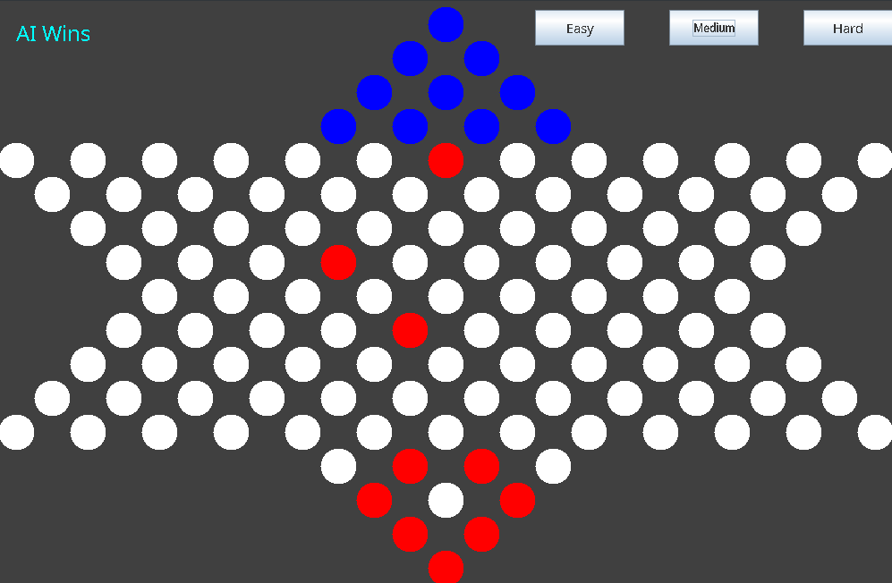
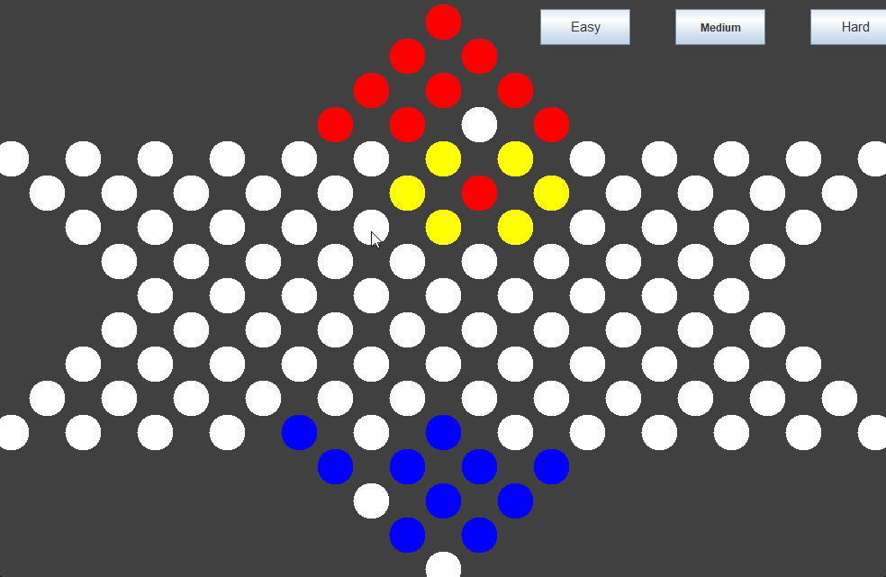
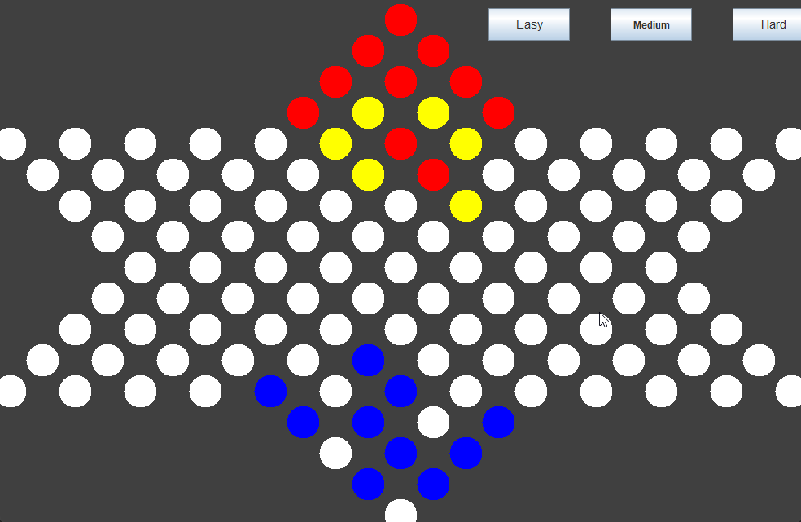

## Game Structure:

We have two ways of describing the game board.
The first way is a 2d grid in which some cells belong to to the game board and 
some do not.

We also have an underlying graph which only contains the actual cells belonging to
the board and there are links between the adjacent cells.

We map between the graph and the grid by simple functions.

This graph also helps us to get all valid moves that could be done by either side.
For the single step moves, we just make all the adjacent cells that are not already
occupied valid moves.
For the hoppping, we do a simple BFS to get all possible cells that a cell might
move to.

## Utility Function:

Our utility function takes into account the manhattan distance from the target cell.
We assign double the weight to the vertical distance because moving up is more 
valuable because there is no link to the above cell in the grid.
We make our target cell the farthest cell in the target triangle which is not 
occupied.

## How to play:

Run the main function in the class called main. To make a move, click on the marble
you want to move and the GUI will display all the cells that you can move to with
yellow, click on any of the yellow cells to move to them.

We made the gui map between our representation of the game board (graph) to the 
click on its own so you can just play with the mouse.

## Screenshots:

